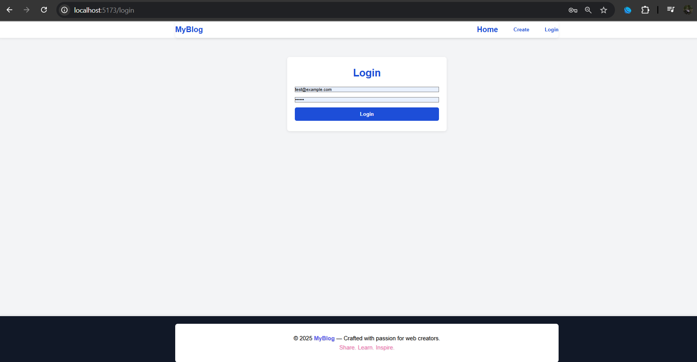
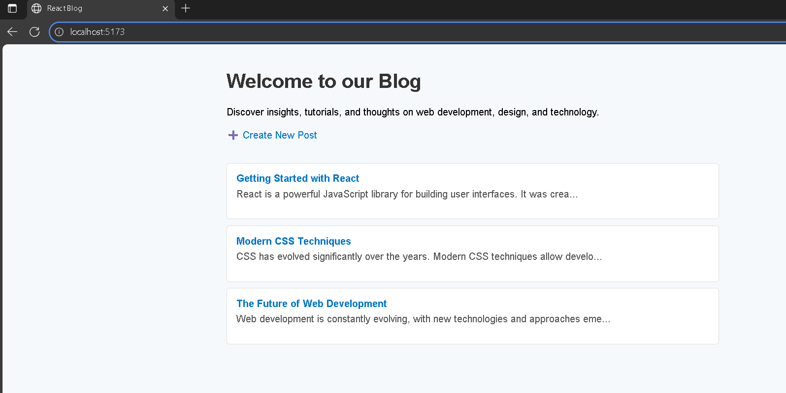
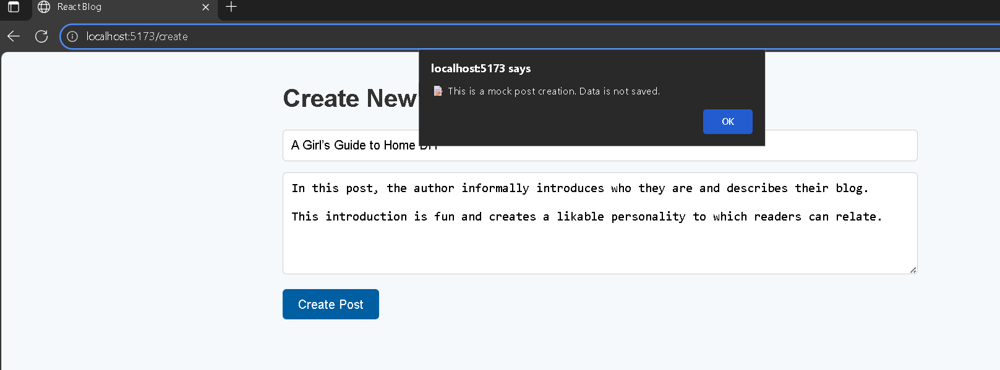
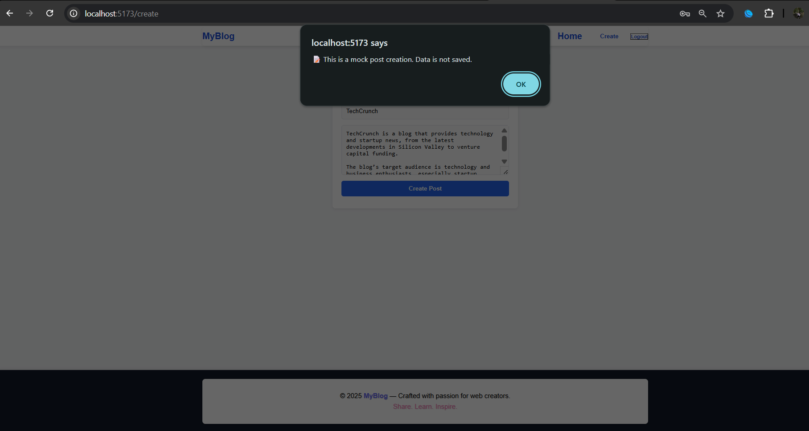

# 📝 React Blog App (Frontend Only)

This is a simple blog application built using **React + Vite** . It uses mock data to simulate a blog experience without a real backend.

---

## 📦 Features

- 🏠 Homepage that lists all blog posts
- 📄 Post detail page to view single blog
- 📝 Form to create a new blog post (mocked)
- 🔁 React Router DOM for navigation
- 📱 Clean, responsive layout

---

## ⚙️ Setup Instructions

### 1. Clone or download the repository

```bash
git clone https://github.com/your-username/react_blog.git
cd react_blog
```

### 2. Install dependencies
```bash
npm install

```

### 3. Run Development server
```bash

npm run dev
```


### 4. Open in browser
http://localhost:5173

### Tech Used

- React 18
- Vite
- React Router DOM
- Mock Data (no backend)

### 🔐 Authentication (Mock)
This project includes a simple mock login system using React Context and localStorage. It protects the /create page so only logged-in users can access it.

### ✅ Login Credentials (for demo)
Email: test@example.com

Password: 123456

### ✨ Features:
Login and Logout options in the header

Create Post button appears only when logged in

Protected route: /create is only accessible after login

Session persists using localStorage

### 🧭 How It Works
AuthContext handles login/logout and user state

ProtectedRoute component restricts access to private pages

Header dynamically shows Login/Create/Logout based on auth state

## 📷 Screenshots

### 🔐 Login


### 🏠 Homepage


### 📝 Create Post


### ✅ Post Created


### 📄 Post Detail


